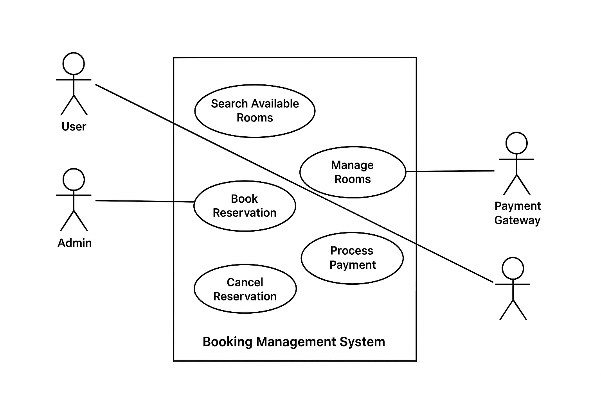

# Requirement Analysis in Software Development

## Introduction
This repository focuses on documenting the **Requirement Analysis** phase of a booking management system.  
The goal is to simulate real-world software development by analyzing, structuring, and documenting requirements to create a solid foundation for project execution.  
Through this project, we aim to ensure clarity, precision, and alignment with business goals before moving into actual development.

---

## What is Requirement Analysis?
Requirement Analysis is the process of identifying, gathering, analyzing, and documenting the needs and expectations of stakeholders for a software system.  
It serves as a critical bridge between the **stakeholders (business, users, clients)** and the **development team**.  

In the **Software Development Lifecycle (SDLC)**, Requirement Analysis ensures:  
- Clear understanding of what the system should achieve.  
- Avoiding costly misunderstandings later in development.  
- Establishing a foundation for design, development, and testing.  

---

## Why is Requirement Analysis Important?
Requirement Analysis is one of the most critical steps in SDLC. Its importance lies in:  

1. **Prevents Scope Creep**  
   By defining clear requirements early, the project avoids uncontrolled feature expansion.  

2. **Saves Cost and Time**  
   Correcting errors in the requirement stage is significantly cheaper than fixing them during development or after release.  

3. **Ensures Alignment with Goals**  
   Ensures the software solution matches **business objectives** and **user needs**, increasing chances of success.  

---

## Key Activities in Requirement Analysis
The process of requirement analysis involves the following key activities:  

- **Requirement Gathering**  
  Collecting initial needs from stakeholders, customers, or end-users.  

- **Requirement Elicitation**  
  Using interviews, surveys, focus groups, and workshops to uncover detailed requirements.  

- **Requirement Documentation**  
  Clearly recording requirements in structured documents like Software Requirement Specifications (SRS).  

- **Requirement Analysis and Modeling**  
  Analyzing, prioritizing, and modeling requirements using diagrams, prototypes, and workflows.  

- **Requirement Validation**  
  Reviewing requirements with stakeholders to ensure they are correct, complete, and feasible.  

---

## Types of Requirements

### Functional Requirements
Functional requirements describe **what the system should do**. They define the features and operations of the system.  

**Examples (Booking Management System):**  
- User can search for available rooms.  
- User can book or cancel a reservation.  
- Admin can add, update, or remove room details.  
- System should send booking confirmation via email.  

### Non-Functional Requirements
Non-functional requirements describe **how the system should perform**. They define quality attributes, constraints, and performance benchmarks.  

**Examples (Booking Management System):**  
- The system must handle **1,000+ concurrent users**.  
- Response time should be less than **2 seconds** for search queries.  
- System uptime should be at least **99.9%** annually.  
- Payment transactions must be secured with **encryption**.  

---

## Use Case Diagrams
Use Case Diagrams are **visual representations** of how users (actors) interact with the system.  
They help in understanding system boundaries, user roles, and key functionalities.  

Below is the Use Case Diagram for the Booking Management System:  

  

---

## Acceptance Criteria
Acceptance Criteria define the **conditions that a feature must meet** to be accepted by stakeholders.  
They ensure that requirements are testable, measurable, and aligned with user needs.  

### Example: Checkout Feature
- User can review booking details before making payment.  
- Payment is processed successfully with valid card details.  
- System generates a unique booking ID upon successful payment.  
- A confirmation message and email are sent to the user.  
- If payment fails, the system displays an error and allows the user to retry.  

---

## 📌 Conclusion
Requirement Analysis is the foundation of successful software development.  
By documenting and validating requirements early, this project ensures that the booking management system is built on a **clear, structured, and goal-aligned blueprint**.
